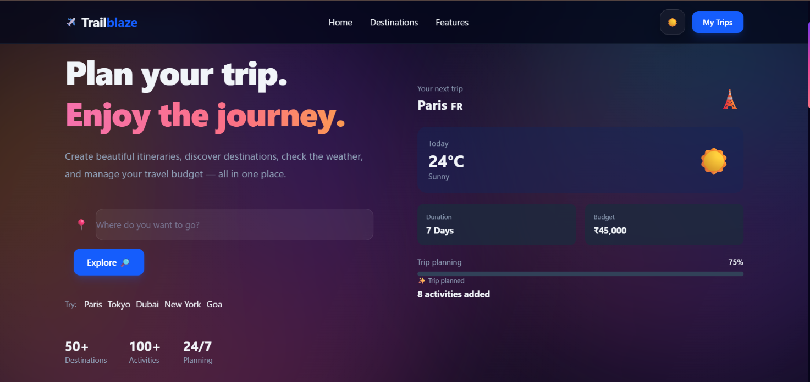
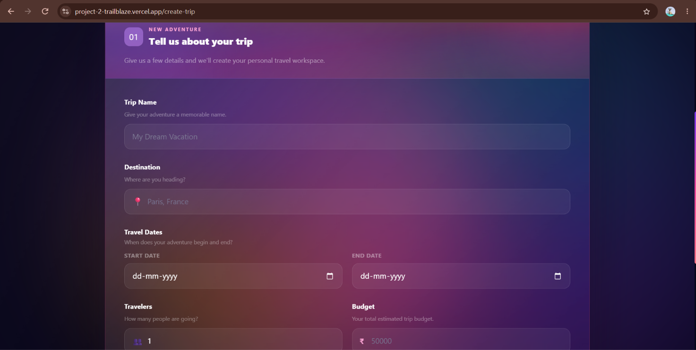
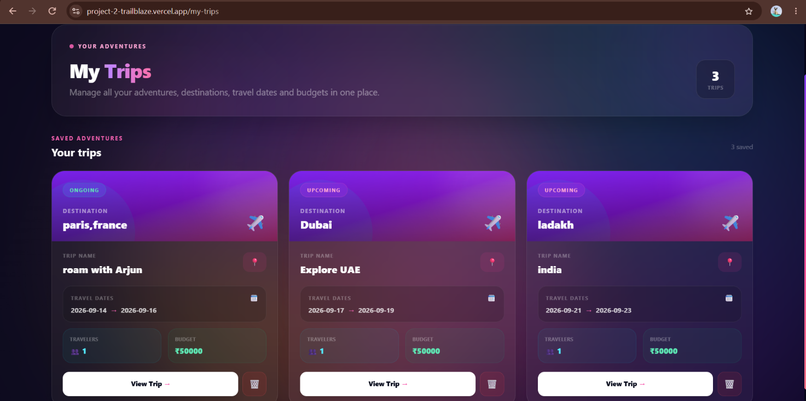
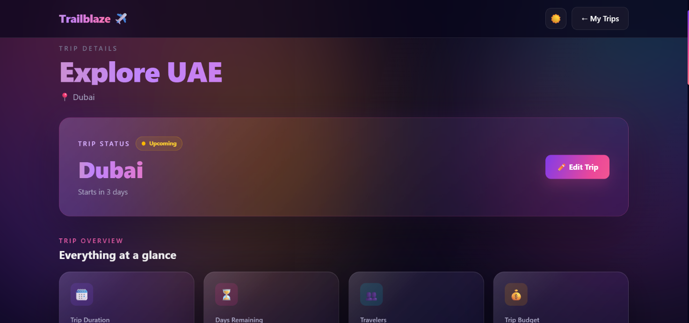

🌍 TrailBlaze

🌐 **Live Demo:** https://project-2-trailblaze.vercel.app/

TrailBlaze is a responsive web application built with React and Tailwind CSS, featuring reusable components, interactive interfaces, theme support, and a clean project structure.

✨ Features
⚛️ React-based component architecture
🎨 Responsive UI with Tailwind CSS
🌙 Theme support
🧩 Reusable components
🧭 Page navigation
📱 Mobile-friendly responsive design
📋 Trip creation and management pages
💻 Clean and organized code structure
🛠️ Technologies Used
React
JavaScript
HTML
Tailwind CSS
Vite
🚀 Getting Started
1. Clone the repository
git clone https://github.com/arjunans909-source/project-2-TrailBlaze.git

2. Open the project
cd project-2-TrailBlaze

3. Install dependencies
npm install

4. Start the development server
npm run dev

Open the local URL shown in the terminal to view the application.

📁 Project Structure
src/
├── components/
├── context/
├── pages/
├── App.jsx
├── index.css
└── main.jsx

public/

👨‍💻 Built With

TrailBlaze was developed using modern frontend technologies including React, JavaScript, Tailwind CSS, HTML, and Vite.

## 📸 Screenshots

### 🏠 Home

### ➕ Create Trip

### 📋 My Trips

### 🗺️ Trip Details

